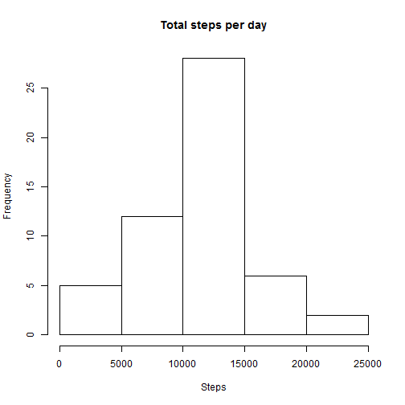
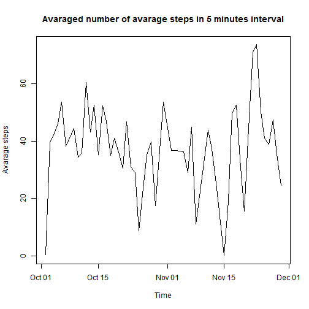
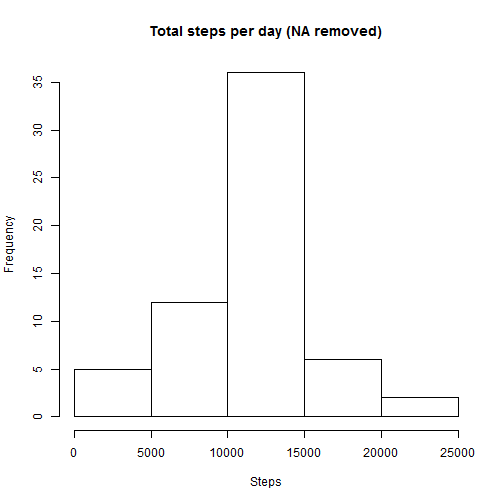
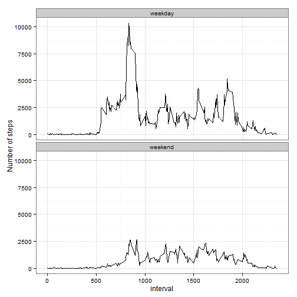

## Loading and preprocessing the data

Load data using standard R function. Assume that the file *activities.csv* is availible on your working directory. In addition convert factors to appropiate dates.


```r
data <- read.csv("activity.csv")
data$date <- as.Date(data$date)
```

## What is mean total number of steps taken per day?

1. Total number of steps taken per day is calculated with by agregating the data. Aggregated data is assigned to new variable.


```r
a <- aggregate(steps ~ date , data=data, FUN=sum)
a
```

```
##          date steps
## 1  2012-10-02   126
## 2  2012-10-03 11352
## 3  2012-10-04 12116
## 4  2012-10-05 13294
## 5  2012-10-06 15420
## 6  2012-10-07 11015
## 7  2012-10-09 12811
## 8  2012-10-10  9900
## 9  2012-10-11 10304
## 10 2012-10-12 17382
## 11 2012-10-13 12426
## 12 2012-10-14 15098
## 13 2012-10-15 10139
## 14 2012-10-16 15084
## 15 2012-10-17 13452
## 16 2012-10-18 10056
## 17 2012-10-19 11829
## 18 2012-10-20 10395
## 19 2012-10-21  8821
## 20 2012-10-22 13460
## 21 2012-10-23  8918
## 22 2012-10-24  8355
## 23 2012-10-25  2492
## 24 2012-10-26  6778
## 25 2012-10-27 10119
## 26 2012-10-28 11458
## 27 2012-10-29  5018
## 28 2012-10-30  9819
## 29 2012-10-31 15414
## 30 2012-11-02 10600
## 31 2012-11-03 10571
## 32 2012-11-05 10439
## 33 2012-11-06  8334
## 34 2012-11-07 12883
## 35 2012-11-08  3219
## 36 2012-11-11 12608
## 37 2012-11-12 10765
## 38 2012-11-13  7336
## 39 2012-11-15    41
## 40 2012-11-16  5441
## 41 2012-11-17 14339
## 42 2012-11-18 15110
## 43 2012-11-19  8841
## 44 2012-11-20  4472
## 45 2012-11-21 12787
## 46 2012-11-22 20427
## 47 2012-11-23 21194
## 48 2012-11-24 14478
## 49 2012-11-25 11834
## 50 2012-11-26 11162
## 51 2012-11-27 13646
## 52 2012-11-28 10183
## 53 2012-11-29  7047
```


2. As a continuation, I construct a histogram of frequencies of total steps per day, given data aggregated before.


```r
hist(a$steps, main="Total steps per day", xlab="Steps")
```

 


3. Finally in this part, I analyze mean and median of total steps taken per day.


```r
mean(a$steps)
```

```
## [1] 10766.19
```

```r
median(a$steps)
```

```
## [1] 10765
```

## What is the average daily activity pattern?

1. Steps represents avarage number in 5 minutes interval. The analysis requires to avarage these values per day. That is: 


```r
avg <- aggregate(steps ~ date , data=data, FUN=mean)
plot(avg$date, avg$steps, xlab="Time", ylab="Avarage steps", main="Avaraged number of avarage steps in 5 minutes interval", type = "l")
```

 

2. Find the maximum avarage across all days, with the following formula:


```r
avg[which.max(avg$steps), ]
```

```
##          date    steps
## 47 2012-11-23 73.59028
```

## Imputing missing values

1. After examining data-set, we can observe there is a number of missing values for *steps* variable.


```r
sum(is.na(data$interval))
```

```
## [1] 0
```

```r
sum(is.na(data$date))
```

```
## [1] 0
```

```r
sum(is.na(data$steps))
```

```
## [1] 2304
```

2. Given missing values, proposed replacing method is to get means by *interval* variable. In order to do it, I create new data-set with means by groups assigned to each record. 


```r
library(plyr)
new.data <-ddply(data, "interval", transform, means = mean(steps, na.rm=TRUE))
```

3. For such created data-set now I can replace missing values for steps: 


```r
new.data[is.na(new.data$steps), "steps"] <- new.data[is.na(new.data$steps), "means"]
```

In this new data-set there is no missing values for steps anymore:


```r
sum(is.na(new.data$steps))
```

```
## [1] 0
```

4. As a continuation, I plot the histogram of total number of steps per day, given NA values being removed:


```r
new.a <- aggregate(steps ~ date , data=new.data, FUN=sum)
hist(new.a$steps, main="Total steps per day (NA removed)", xlab="Steps")
```

 

In addition, I review mean and median for this new data-set.


```r
mean(new.a$steps)
```

```
## [1] 10766.19
```

```r
median(new.a$steps)
```

```
## [1] 10766.19
```

Observed impact is that the *mean* and *median* values getting equals.

## Are there differences in activity patterns between weekdays and weekends?

1. Next, I create new variable *day.type*, which indicates whether each particualr day is weekday or weekend.


```r
day.type <- lapply (weekdays(new.data$date), function(u) if(u %in% c("Saturday","Sunday")) "weekend" else "weekday")
new.data$day.type <- as.factor(unlist(day.type))
```

2. In order to compare avarages number of steps in intervals during weekdays and weekend, I construct the following:


```r
library(ggplot2)
a1 <- aggregate(steps ~ interval+day.type , data=new.data, FUN=sum)
```

I also construct the plot to ilustrate the diffrences:


```r
p <- ggplot(a1, aes(x=interval, y=steps)) + theme_bw()
p <- p + geom_line() 
p <- p + facet_wrap( ~ day.type, ncol=1 )
p <- p + ylab("Number of steps")
p
```

 
        
        
        
        
        
